# Concept DAG

**Generated by `mimic_utils concept_dag` — do not hand-edit.** Every regeneration overwrites this file wholesale, so a checkbox, a status column or a progress note added here is lost without warning. Live conversion progress is `mimic_utils status`; this file is structure only. Change what it says by changing the concept SQL.

**Parser:** sqlglot 30.15.0
**Source root:** mimic-iv/concepts
**Total concepts:** 65
**Total edges:** 91

## Ready / Status

Concepts are organised by build level. Level 0 concepts have no `mimiciv_derived` dependencies and are statically ready. Higher levels become ready when each concept's listed dependencies are completed. Run `mimic_utils status` for live conversion readiness.

| Level | Concepts | Ready? |
|-------|----------|--------|
| 0 | 37 | READY |
| 1 | 17 | after listed dependencies |
| 2 | 10 | after listed dependencies |
| 3 | 1 | after listed dependencies |

## Build Levels

### Level 0 (37 concepts)

| Concept | Path |
|---------|------|
| `acei` | `medication/acei.sql` |
| `age` | `demographics/age.sql` |
| `antibiotic` | `medication/antibiotic.sql` |
| `arb` | `medication/arb.sql` |
| `bg` | `measurement/bg.sql` |
| `blood_differential` | `measurement/blood_differential.sql` |
| `cardiac_marker` | `measurement/cardiac_marker.sql` |
| `chemistry` | `measurement/chemistry.sql` |
| `coagulation` | `measurement/coagulation.sql` |
| `code_status` | `treatment/code_status.sql` |
| `complete_blood_count` | `measurement/complete_blood_count.sql` |
| `crrt` | `treatment/crrt.sql` |
| `dobutamine` | `medication/dobutamine.sql` |
| `dopamine` | `medication/dopamine.sql` |
| `enzyme` | `measurement/enzyme.sql` |
| `epinephrine` | `medication/epinephrine.sql` |
| `gcs` | `measurement/gcs.sql` |
| `height` | `measurement/height.sql` |
| `icp` | `measurement/icp.sql` |
| `icustay_detail` | `demographics/icustay_detail.sql` |
| `icustay_times` | `demographics/icustay_times.sql` |
| `inflammation` | `measurement/inflammation.sql` |
| `invasive_line` | `treatment/invasive_line.sql` |
| `kdigo_creatinine` | `organfailure/kdigo_creatinine.sql` |
| `milrinone` | `medication/milrinone.sql` |
| `neuroblock` | `medication/neuroblock.sql` |
| `norepinephrine` | `medication/norepinephrine.sql` |
| `nsaid` | `medication/nsaid.sql` |
| `oxygen_delivery` | `measurement/oxygen_delivery.sql` |
| `phenylephrine` | `medication/phenylephrine.sql` |
| `rhythm` | `measurement/rhythm.sql` |
| `rrt` | `treatment/rrt.sql` |
| `urine_output` | `measurement/urine_output.sql` |
| `vasopressin` | `medication/vasopressin.sql` |
| `ventilator_setting` | `measurement/ventilator_setting.sql` |
| `vitalsign` | `measurement/vitalsign.sql` |
| `weight_durations` | `demographics/weight_durations.sql` |

### Level 1 (17 concepts)

| Concept | Path | Dependencies |
|---------|------|-------------|
| `charlson` | `comorbidity/charlson.sql` | `age` |
| `creatinine_baseline` | `measurement/creatinine_baseline.sql` | `age`, `chemistry` |
| `first_day_bg` | `firstday/first_day_bg.sql` | `bg` |
| `first_day_bg_art` | `firstday/first_day_bg_art.sql` | `bg` |
| `first_day_gcs` | `firstday/first_day_gcs.sql` | `gcs` |
| `first_day_height` | `firstday/first_day_height.sql` | `height` |
| `first_day_lab` | `firstday/first_day_lab.sql` | `blood_differential`, `chemistry`, `coagulation`, `complete_blood_count`, `enzyme` |
| `first_day_rrt` | `firstday/first_day_rrt.sql` | `rrt` |
| `first_day_urine_output` | `firstday/first_day_urine_output.sql` | `urine_output` |
| `first_day_vitalsign` | `firstday/first_day_vitalsign.sql` | `vitalsign` |
| `first_day_weight` | `firstday/first_day_weight.sql` | `weight_durations` |
| `icustay_hourly` | `demographics/icustay_hourly.sql` | `icustay_times` |
| `kdigo_uo` | `organfailure/kdigo_uo.sql` | `urine_output`, `weight_durations` |
| `suspicion_of_infection` | `sepsis/suspicion_of_infection.sql` | `antibiotic` |
| `urine_output_rate` | `measurement/urine_output_rate.sql` | `urine_output`, `weight_durations` |
| `vasoactive_agent` | `medication/vasoactive_agent.sql` | `dobutamine`, `dopamine`, `epinephrine`, `milrinone`, `norepinephrine`, `phenylephrine`, `vasopressin` |
| `ventilation` | `treatment/ventilation.sql` | `oxygen_delivery`, `ventilator_setting` |

### Level 2 (10 concepts)

| Concept | Path | Dependencies |
|---------|------|-------------|
| `apsiii` | `score/apsiii.sql` | `bg`, `first_day_gcs`, `first_day_lab`, `first_day_urine_output`, `first_day_vitalsign`, `ventilation` |
| `first_day_sofa` | `firstday/first_day_sofa.sql` | `bg`, `dobutamine`, `dopamine`, `epinephrine`, `first_day_gcs`, `first_day_lab`, `first_day_urine_output`, `first_day_vitalsign`, `norepinephrine`, `ventilation` |
| `kdigo_stages` | `organfailure/kdigo_stages.sql` | `crrt`, `kdigo_creatinine`, `kdigo_uo` |
| `lods` | `score/lods.sql` | `bg`, `first_day_gcs`, `first_day_lab`, `first_day_urine_output`, `first_day_vitalsign`, `ventilation` |
| `meld` | `organfailure/meld.sql` | `first_day_lab`, `first_day_rrt` |
| `norepinephrine_equivalent_dose` | `medication/norepinephrine_equivalent_dose.sql` | `vasoactive_agent` |
| `oasis` | `score/oasis.sql` | `age`, `first_day_gcs`, `first_day_urine_output`, `first_day_vitalsign`, `ventilation` |
| `sapsii` | `score/sapsii.sql` | `age`, `bg`, `chemistry`, `complete_blood_count`, `enzyme`, `gcs`, `urine_output`, `ventilation`, `vitalsign` |
| `sirs` | `score/sirs.sql` | `first_day_bg_art`, `first_day_lab`, `first_day_vitalsign` |
| `sofa` | `score/sofa.sql` | `bg`, `chemistry`, `complete_blood_count`, `dobutamine`, `dopamine`, `enzyme`, `epinephrine`, `gcs`, `icustay_hourly`, `norepinephrine`, `urine_output_rate`, `ventilation`, `vitalsign` |

### Level 3 (1 concepts)

| Concept | Path | Dependencies |
|---------|------|-------------|
| `sepsis3` | `sepsis/sepsis3.sql` | `sofa`, `suspicion_of_infection` |

## Topological Build Order

1. `acei` (level 0)
2. `age` (level 0)
3. `antibiotic` (level 0)
4. `arb` (level 0)
5. `bg` (level 0)
6. `blood_differential` (level 0)
7. `cardiac_marker` (level 0)
8. `charlson` (level 1)
9. `chemistry` (level 0)
10. `coagulation` (level 0)
11. `code_status` (level 0)
12. `complete_blood_count` (level 0)
13. `creatinine_baseline` (level 1)
14. `crrt` (level 0)
15. `dobutamine` (level 0)
16. `dopamine` (level 0)
17. `enzyme` (level 0)
18. `epinephrine` (level 0)
19. `first_day_bg` (level 1)
20. `first_day_bg_art` (level 1)
21. `first_day_lab` (level 1)
22. `gcs` (level 0)
23. `first_day_gcs` (level 1)
24. `height` (level 0)
25. `first_day_height` (level 1)
26. `icp` (level 0)
27. `icustay_detail` (level 0)
28. `icustay_times` (level 0)
29. `icustay_hourly` (level 1)
30. `inflammation` (level 0)
31. `invasive_line` (level 0)
32. `kdigo_creatinine` (level 0)
33. `milrinone` (level 0)
34. `neuroblock` (level 0)
35. `norepinephrine` (level 0)
36. `nsaid` (level 0)
37. `oxygen_delivery` (level 0)
38. `phenylephrine` (level 0)
39. `rhythm` (level 0)
40. `rrt` (level 0)
41. `first_day_rrt` (level 1)
42. `meld` (level 2)
43. `suspicion_of_infection` (level 1)
44. `urine_output` (level 0)
45. `first_day_urine_output` (level 1)
46. `vasopressin` (level 0)
47. `vasoactive_agent` (level 1)
48. `norepinephrine_equivalent_dose` (level 2)
49. `ventilator_setting` (level 0)
50. `ventilation` (level 1)
51. `vitalsign` (level 0)
52. `first_day_vitalsign` (level 1)
53. `apsiii` (level 2)
54. `first_day_sofa` (level 2)
55. `lods` (level 2)
56. `oasis` (level 2)
57. `sapsii` (level 2)
58. `sirs` (level 2)
59. `weight_durations` (level 0)
60. `first_day_weight` (level 1)
61. `kdigo_uo` (level 1)
62. `kdigo_stages` (level 2)
63. `urine_output_rate` (level 1)
64. `sofa` (level 2)
65. `sepsis3` (level 3)

## External Raw Tables

| Table | Schema | Referenced By |
|-------|--------|--------------|
| `admissions` | `mimiciv_hosp` | `age`, `apsiii`, `charlson`, `icustay_detail`, `lods`, `oasis`, `sapsii` |
| `diagnoses_icd` | `mimiciv_hosp` | `apsiii`, `charlson`, `creatinine_baseline`, `sapsii` |
| `labevents` | `mimiciv_hosp` | `bg`, `blood_differential`, `cardiac_marker`, `chemistry`, `coagulation`, `complete_blood_count`, `enzyme`, `inflammation`, `kdigo_creatinine` |
| `microbiologyevents` | `mimiciv_hosp` | `suspicion_of_infection` |
| `patients` | `mimiciv_hosp` | `age`, `apsiii`, `creatinine_baseline`, `icustay_detail`, `lods`, `oasis` |
| `poe` | `mimiciv_hosp` | `code_status` |
| `poe_detail` | `mimiciv_hosp` | `code_status` |
| `prescriptions` | `mimiciv_hosp` | `acei`, `antibiotic`, `arb`, `nsaid` |
| `services` | `mimiciv_hosp` | `oasis`, `sapsii` |
| `chartevents` | `mimiciv_icu` | `bg`, `code_status`, `crrt`, `gcs`, `height`, `icp`, `icustay_times`, `lods`, `oxygen_delivery`, `rhythm`, `rrt`, `sapsii`, `urine_output_rate`, `ventilator_setting`, `vitalsign`, `weight_durations` |
| `d_items` | `mimiciv_icu` | `invasive_line` |
| `icustays` | `mimiciv_icu` | `antibiotic`, `apsiii`, `code_status`, `first_day_bg`, `first_day_bg_art`, `first_day_gcs`, `first_day_height`, `first_day_lab`, `first_day_rrt`, `first_day_sofa`, `first_day_urine_output`, `first_day_vitalsign`, `first_day_weight`, `icustay_detail`, `icustay_times`, `kdigo_creatinine`, `kdigo_stages`, `kdigo_uo`, `lods`, `meld`, `oasis`, `sapsii`, `sirs`, `sofa`, `urine_output_rate`, `weight_durations` |
| `inputevents` | `mimiciv_icu` | `dobutamine`, `dopamine`, `epinephrine`, `milrinone`, `neuroblock`, `norepinephrine`, `phenylephrine`, `rrt`, `vasopressin` |
| `outputevents` | `mimiciv_icu` | `urine_output` |
| `procedureevents` | `mimiciv_icu` | `invasive_line`, `rrt` |

## Dependency Graph

*Arrow direction: consumer → dependency (A depends on B).*

```mermaid
graph TD
  apsiii --> bg
  apsiii --> first_day_gcs
  apsiii --> first_day_lab
  apsiii --> first_day_urine_output
  apsiii --> first_day_vitalsign
  apsiii --> ventilation
  charlson --> age
  creatinine_baseline --> age
  creatinine_baseline --> chemistry
  first_day_bg --> bg
  first_day_bg_art --> bg
  first_day_gcs --> gcs
  first_day_height --> height
  first_day_lab --> blood_differential
  first_day_lab --> chemistry
  first_day_lab --> coagulation
  first_day_lab --> complete_blood_count
  first_day_lab --> enzyme
  first_day_rrt --> rrt
  first_day_sofa --> bg
  first_day_sofa --> dobutamine
  first_day_sofa --> dopamine
  first_day_sofa --> epinephrine
  first_day_sofa --> first_day_gcs
  first_day_sofa --> first_day_lab
  first_day_sofa --> first_day_urine_output
  first_day_sofa --> first_day_vitalsign
  first_day_sofa --> norepinephrine
  first_day_sofa --> ventilation
  first_day_urine_output --> urine_output
  first_day_vitalsign --> vitalsign
  first_day_weight --> weight_durations
  icustay_hourly --> icustay_times
  kdigo_stages --> crrt
  kdigo_stages --> kdigo_creatinine
  kdigo_stages --> kdigo_uo
  kdigo_uo --> urine_output
  kdigo_uo --> weight_durations
  lods --> bg
  lods --> first_day_gcs
  lods --> first_day_lab
  lods --> first_day_urine_output
  lods --> first_day_vitalsign
  lods --> ventilation
  meld --> first_day_lab
  meld --> first_day_rrt
  norepinephrine_equivalent_dose --> vasoactive_agent
  oasis --> age
  oasis --> first_day_gcs
  oasis --> first_day_urine_output
  oasis --> first_day_vitalsign
  oasis --> ventilation
  sapsii --> age
  sapsii --> bg
  sapsii --> chemistry
  sapsii --> complete_blood_count
  sapsii --> enzyme
  sapsii --> gcs
  sapsii --> urine_output
  sapsii --> ventilation
  sapsii --> vitalsign
  sepsis3 --> sofa
  sepsis3 --> suspicion_of_infection
  sirs --> first_day_bg_art
  sirs --> first_day_lab
  sirs --> first_day_vitalsign
  sofa --> bg
  sofa --> chemistry
  sofa --> complete_blood_count
  sofa --> dobutamine
  sofa --> dopamine
  sofa --> enzyme
  sofa --> epinephrine
  sofa --> gcs
  sofa --> icustay_hourly
  sofa --> norepinephrine
  sofa --> urine_output_rate
  sofa --> ventilation
  sofa --> vitalsign
  suspicion_of_infection --> antibiotic
  urine_output_rate --> urine_output
  urine_output_rate --> weight_durations
  vasoactive_agent --> dobutamine
  vasoactive_agent --> dopamine
  vasoactive_agent --> epinephrine
  vasoactive_agent --> milrinone
  vasoactive_agent --> norepinephrine
  vasoactive_agent --> phenylephrine
  vasoactive_agent --> vasopressin
  ventilation --> oxygen_delivery
  ventilation --> ventilator_setting
```

## All Concepts

| Concept | Path | SHA256 | Level | Deps |
|---------|------|--------|-------|------|
| `acei` | `medication/acei.sql` | `6a5ec32282f6` | 0 | 0 |
| `age` | `demographics/age.sql` | `b91101e98437` | 0 | 0 |
| `antibiotic` | `medication/antibiotic.sql` | `300816a74a07` | 0 | 0 |
| `apsiii` | `score/apsiii.sql` | `9692a6342940` | 2 | 6 |
| `arb` | `medication/arb.sql` | `e24b91d1ecf8` | 0 | 0 |
| `bg` | `measurement/bg.sql` | `90a7f58852b5` | 0 | 0 |
| `blood_differential` | `measurement/blood_differential.sql` | `a93f21dfb29e` | 0 | 0 |
| `cardiac_marker` | `measurement/cardiac_marker.sql` | `a8e02e5df608` | 0 | 0 |
| `charlson` | `comorbidity/charlson.sql` | `5b797b673ace` | 1 | 1 |
| `chemistry` | `measurement/chemistry.sql` | `b674ae2e12fe` | 0 | 0 |
| `coagulation` | `measurement/coagulation.sql` | `d6f9ba24d887` | 0 | 0 |
| `code_status` | `treatment/code_status.sql` | `b8c92ff0d4c7` | 0 | 0 |
| `complete_blood_count` | `measurement/complete_blood_count.sql` | `8eb94ba8891e` | 0 | 0 |
| `creatinine_baseline` | `measurement/creatinine_baseline.sql` | `3ca2e029f270` | 1 | 2 |
| `crrt` | `treatment/crrt.sql` | `6fffa92ab889` | 0 | 0 |
| `dobutamine` | `medication/dobutamine.sql` | `7b74249ebca2` | 0 | 0 |
| `dopamine` | `medication/dopamine.sql` | `4809121abcd1` | 0 | 0 |
| `enzyme` | `measurement/enzyme.sql` | `5c719b94ec99` | 0 | 0 |
| `epinephrine` | `medication/epinephrine.sql` | `97c1c3cf8c54` | 0 | 0 |
| `first_day_bg` | `firstday/first_day_bg.sql` | `3c2ff855bc1f` | 1 | 1 |
| `first_day_bg_art` | `firstday/first_day_bg_art.sql` | `f3ef6de5f9b0` | 1 | 1 |
| `first_day_gcs` | `firstday/first_day_gcs.sql` | `ebbabc9c407d` | 1 | 1 |
| `first_day_height` | `firstday/first_day_height.sql` | `4ac0656fe433` | 1 | 1 |
| `first_day_lab` | `firstday/first_day_lab.sql` | `bf7b28285795` | 1 | 5 |
| `first_day_rrt` | `firstday/first_day_rrt.sql` | `24b7035b8582` | 1 | 1 |
| `first_day_sofa` | `firstday/first_day_sofa.sql` | `e56ae4c67d7b` | 2 | 10 |
| `first_day_urine_output` | `firstday/first_day_urine_output.sql` | `2ddae1a9d4d0` | 1 | 1 |
| `first_day_vitalsign` | `firstday/first_day_vitalsign.sql` | `f85ecb807cbd` | 1 | 1 |
| `first_day_weight` | `firstday/first_day_weight.sql` | `be5dbedf07b3` | 1 | 1 |
| `gcs` | `measurement/gcs.sql` | `77d14660a832` | 0 | 0 |
| `height` | `measurement/height.sql` | `9b024d54f770` | 0 | 0 |
| `icp` | `measurement/icp.sql` | `d7a6ad8f8c45` | 0 | 0 |
| `icustay_detail` | `demographics/icustay_detail.sql` | `35103cee621e` | 0 | 0 |
| `icustay_hourly` | `demographics/icustay_hourly.sql` | `6e20f8fba635` | 1 | 1 |
| `icustay_times` | `demographics/icustay_times.sql` | `a26457b40e30` | 0 | 0 |
| `inflammation` | `measurement/inflammation.sql` | `88b7cc933d28` | 0 | 0 |
| `invasive_line` | `treatment/invasive_line.sql` | `61c8d3a30219` | 0 | 0 |
| `kdigo_creatinine` | `organfailure/kdigo_creatinine.sql` | `a7daeaf1c58c` | 0 | 0 |
| `kdigo_stages` | `organfailure/kdigo_stages.sql` | `ecfa0c8c343d` | 2 | 3 |
| `kdigo_uo` | `organfailure/kdigo_uo.sql` | `7b4e012a2dc3` | 1 | 2 |
| `lods` | `score/lods.sql` | `ddfc09733ed1` | 2 | 6 |
| `meld` | `organfailure/meld.sql` | `a7ce07eb899f` | 2 | 2 |
| `milrinone` | `medication/milrinone.sql` | `5ff338dcfd6d` | 0 | 0 |
| `neuroblock` | `medication/neuroblock.sql` | `1e42f6d1f894` | 0 | 0 |
| `norepinephrine` | `medication/norepinephrine.sql` | `4972b33d3dce` | 0 | 0 |
| `norepinephrine_equivalent_dose` | `medication/norepinephrine_equivalent_dose.sql` | `b4c4840d06b0` | 2 | 1 |
| `nsaid` | `medication/nsaid.sql` | `5289cf2b0e5c` | 0 | 0 |
| `oasis` | `score/oasis.sql` | `7b5082e8e66d` | 2 | 5 |
| `oxygen_delivery` | `measurement/oxygen_delivery.sql` | `b3c9df45c64a` | 0 | 0 |
| `phenylephrine` | `medication/phenylephrine.sql` | `173331e5ad8a` | 0 | 0 |
| `rhythm` | `measurement/rhythm.sql` | `97a4b14b1d49` | 0 | 0 |
| `rrt` | `treatment/rrt.sql` | `9b0b11a15f44` | 0 | 0 |
| `sapsii` | `score/sapsii.sql` | `a7f474712fd8` | 2 | 9 |
| `sepsis3` | `sepsis/sepsis3.sql` | `1d06e0efed85` | 3 | 2 |
| `sirs` | `score/sirs.sql` | `0d5f398c452d` | 2 | 3 |
| `sofa` | `score/sofa.sql` | `a2dcdfa54c7d` | 2 | 13 |
| `suspicion_of_infection` | `sepsis/suspicion_of_infection.sql` | `943d9a7a4058` | 1 | 1 |
| `urine_output` | `measurement/urine_output.sql` | `51de17db6f24` | 0 | 0 |
| `urine_output_rate` | `measurement/urine_output_rate.sql` | `2a94ace1b310` | 1 | 2 |
| `vasoactive_agent` | `medication/vasoactive_agent.sql` | `7c8fd57ead83` | 1 | 7 |
| `vasopressin` | `medication/vasopressin.sql` | `13a5e11dd3a4` | 0 | 0 |
| `ventilation` | `treatment/ventilation.sql` | `8d7ce56f2d71` | 1 | 2 |
| `ventilator_setting` | `measurement/ventilator_setting.sql` | `80ac2b4bde1d` | 0 | 0 |
| `vitalsign` | `measurement/vitalsign.sql` | `9a618fb7f6bf` | 0 | 0 |
| `weight_durations` | `demographics/weight_durations.sql` | `82e23dd4ac6d` | 0 | 0 |
